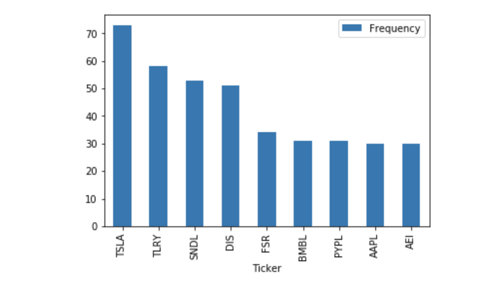

# D.E.G.A._StockScreener

+ Summary.
+ Tools used.
+ Description of the data.
+ Links for the code.

## 1. Summary.

Our project is meant to serve as a Proof of Concept. We achieved this by gathering data from the Twitter API. We analyze 20,000 tweets from various finance gurus and influencers within a week timeframe. With the data we gathered, we fetched tickers using the dollar symbol. We counted the tickers to find the ones that were being talked the most. Then we obtained the top tickers and we analyzed the correlation of those tickers. 

Our top tickers looked like this:



From our twitter data, the ticker being talked the most is Tesla.

## 2. Tools used.


In order to run the notebook with the code of this project, you need a twitter developer account, after being approved, we received the consumer keys, consumer_secrets, access_token and access_token_secret to access the API. Here is a link to help you start learning about the Twitter API, [Twitter Starter Guide.](https://developer.twitter.com/en/docs/twitter-api/getting-started/guide)
Once you have the keys, you must create a file called API.env on the same folder you are running the notebook with the following:

```
consumer_keys = "Enter it here"
consumer_secrets = "Enter it here"
access_token = "Enter it here"
access_token_secret = "Enter it here"
```
Once you have that set up you are going to need python. This can be done by going to the [python](https://www.python.org/downloads/) website if you don't have it.

In order to run the notebook, we are using a jupyter notebook in an anaconda environment. If you do not have anaconda, check the [Anaconda installation documentation.](https://docs.anaconda.com/anaconda/install/) We also downloaded all the pips in a conda environment. If you don't have and environment set up in conda, follow the commands/instructions below.
```
conda create -n dev python=3.7 anaconda #to create conda environment called dev
conda activate dev  #to activate the environment
conda deactivate dev #command used after all the downloads have been made
```

You need to check your environment to check to see if you have the following pips. If you don't, activate your environment and install these pips in that conda environment:

```
pip install tweepy
pip install yfinance 
pip install -U python-dotenv
pip install -U textblob
pip install seaborn
pip install matplotlib.pyplot
pip install regex
pip install requests
pip install datetime
pip install alpaca-trade-api
pip install pandas
```

These are the libraries we imported to run our notebook from the pip's from above.

```
import tweepy
import pandas as pd
import re
import yfinance as yf
import pandas as pd
import matplotlib.pyplot as plt
import seaborn as sns
import datetime
import time
import requests
import os
from tweepy import OAuthHandler
import alpaca_trade_api as tradeapi
from MCForecastTools import MCSimulation
#from dotenv import load_dotenv
from textblob import TextBlob
```

## 3. Description of the data.


The data from the Project was fetched from the twitter API. It compiled of tweets from 100 different people, finance gurus and influencers. We fetched the data from 4 sets of 25. The data is from Feb 8 to 13th. 200 tweets are being fetched per person a total of 20,000 tweets.

The financial data on the other hand was fetched from yfinance. The information being fetched from each ticker is the Open, High, Low, Close, Adj Close and Volume.

## 4. Link to our code.

* [Notebook of the code](DEGA.ipynb)
* [DEGA tool- a tool to save tweets](DEGA_TOOL.ipynb)


